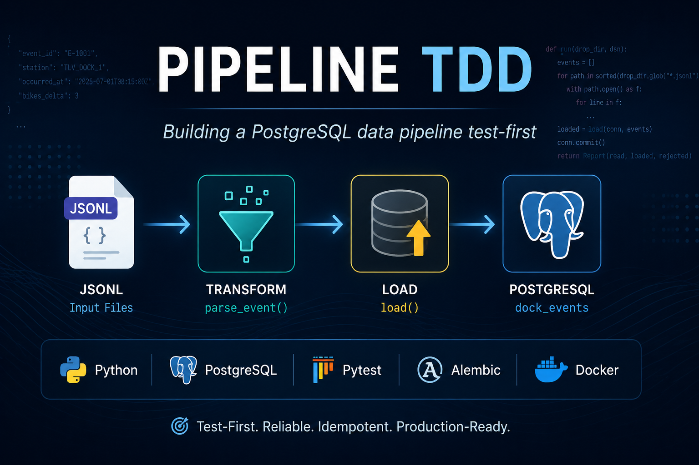
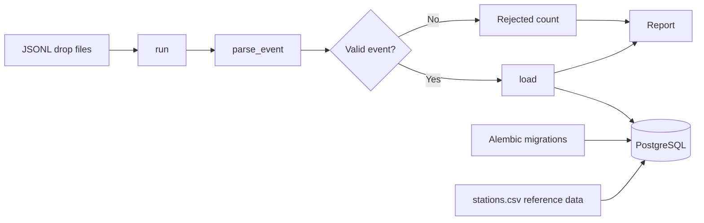
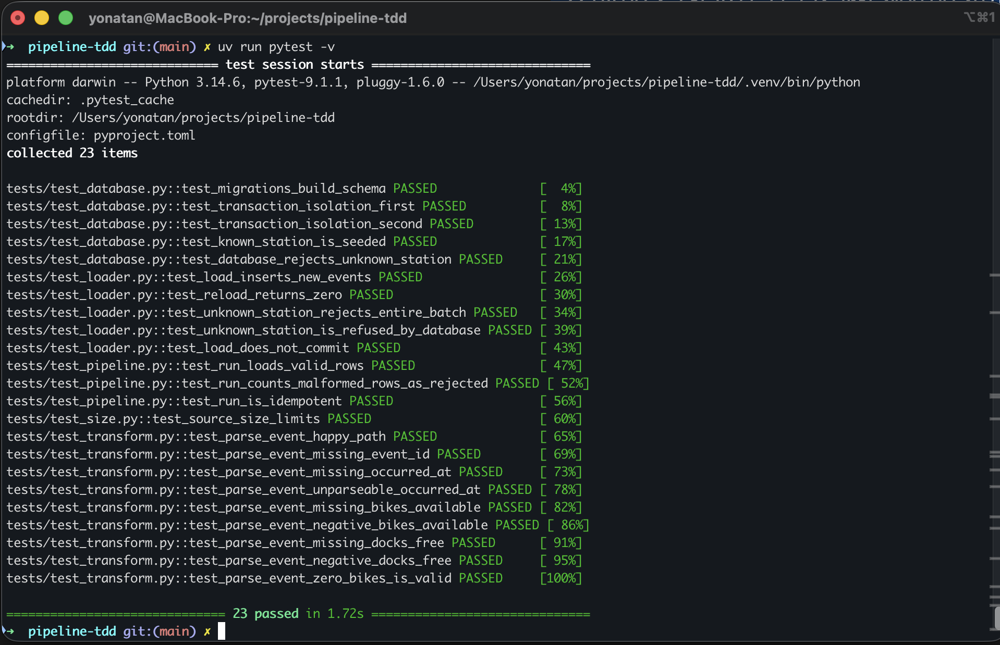
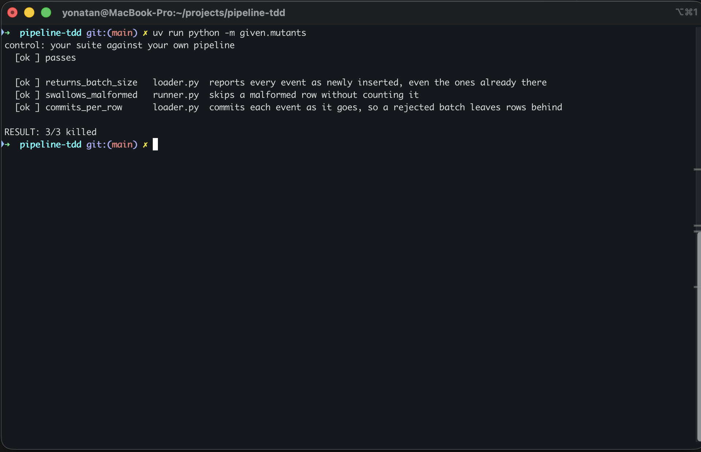

<p align="center">
  
</p>

# Pipeline TDD

A Python dock-event ingestion pipeline that validates JSONL records, loads valid events into PostgreSQL, rejects malformed rows, and supports safe idempotent reruns — built entirely test-first against a real temporary database.

<p>
  
  
  
  
  
  
</p>

## Overview

Pipeline TDD processes one or more `.jsonl` dock-event files and loads valid station status events into PostgreSQL.

For every input directory, the pipeline:

1. reads every `.jsonl` file
2. parses and validates each event
3. rejects malformed rows without stopping the run
4. inserts valid events into PostgreSQL
5. ignores duplicate `event_id` values safely
6. returns a structured `Report` containing rows read, loaded, and rejected

The project was built with a strict RED → GREEN → REFACTOR workflow. Its main focus is not only pipeline correctness, but proving that the test suite can detect realistic implementation bugs.

## Architecture



## Core Features

- JSONL dock-event ingestion
- Pure record parsing and validation
- PostgreSQL persistence with Psycopg
- Idempotent loading with `ON CONFLICT DO NOTHING`
- Database-enforced station integrity
- Malformed-row rejection without terminating the run
- Structured `Report(read, loaded, rejected)` results
- Real Alembic migrations inside the test environment
- PostgreSQL integration tests with Testcontainers
- Transaction rollback isolation for loader/database tests
- TRUNCATE isolation for committed end-to-end pipeline runs
- Mutation testing against deliberately broken implementations
- Source-size gate for focused functions
- Strict static type checking with MyPy

## Tech Stack

| Category | Technology |
|---|---|
| Language | Python 3.11+ |
| Database | PostgreSQL 16 |
| Database driver | Psycopg 3 |
| Migrations | Alembic |
| Integration testing | Testcontainers |
| Testing | Pytest |
| Type checking | MyPy |
| Dependency management | uv |
| Containers | Docker |
| Version control | Git / GitHub |

## Project Structure

```text
pipeline-tdd/
├── alembic/
│   ├── env.py
│   └── versions/              # Database migrations
│
├── assets/
│   ├── hero.png
│   └── screenshots/
│       ├── mutation-testing.png
│       └── test-suite.png
│
├── given/
│   ├── drops/                 # Example JSONL input
│   ├── mutants/               # Deliberately broken implementations
│   └── seed/
│       └── stations.csv       # Reference station data
│
├── src/
│   └── pipeline/
│       ├── errors.py          # Domain-specific exceptions
│       ├── loader.py          # PostgreSQL loading
│       ├── model.py           # DockEvent and Report models
│       ├── runner.py          # Pipeline orchestration
│       └── transform.py       # Parsing and validation
│
├── tests/
│   ├── conftest.py            # PostgreSQL and isolation fixtures
│   ├── test_database.py       # Schema and database behavior
│   ├── test_loader.py         # Loader integration tests
│   ├── test_pipeline.py       # End-to-end pipeline tests
│   ├── test_size.py           # Source-size gate
│   └── test_transform.py      # Pure transform tests
│
├── tools/
│   └── check_loc.py
│
├── ANSWERS.md
├── alembic.ini
├── pyproject.toml
└── uv.lock
```

## Testing Strategy

This project was built test-first.

For each behavior:

```text
RED
Write a failing test

↓

GREEN
Write the minimum implementation required to pass

↓

REFACTOR
Improve the design while keeping the suite green
```

The Git history preserves this process with separate failing-test and implementation commits.

The test suite deliberately separates fast pure tests from database-backed integration tests.

### Pure Transform Tests

`parse_event()` is tested without PostgreSQL, Docker, or filesystem dependencies.

The transform suite covers:

- valid events
- missing `event_id`
- missing `occurred_at`
- invalid timestamps
- missing counts
- negative counts
- zero as a valid count

### PostgreSQL Integration Tests

Database tests run against a temporary PostgreSQL 16 container created with Testcontainers.

The session fixture:

1. starts PostgreSQL
2. applies the real Alembic migrations
3. seeds `given/seed/stations.csv`
4. exposes isolated database connections to the tests

The database disappears when the test session ends.

### Real Migration Verification

The suite does not create test-only tables.

Instead, it runs the actual migration chain used by the application and verifies that:

- `stations` exists
- `dock_events` exists
- the station/time index from the final migration exists

This helps ensure that tests and production-style schema creation follow the same path.

## Test Isolation

The suite uses two isolation strategies because the code under test has different transaction behavior.

### Rollback Isolation

Database and loader tests receive a connection inside a transaction.

At the end of each test:

```text
ROLLBACK
```

removes all test-created rows.

This keeps the tests fast and prevents data from leaking between them.

### TRUNCATE Isolation

`run()` opens its own database connection and commits.

Once the code under test commits, an outer rollback fixture cannot undo those rows.

End-to-end pipeline tests therefore use:

```sql
TRUNCATE TABLE dock_events;
```

before and after each test.

This distinction is intentional and tests real transaction ownership rather than hiding it.

## Test Suite Result

<p align="center">
  
</p>

Current result:

```text
23 passed
```

The suite includes:

- transform tests
- migration and schema tests
- transaction isolation tests
- reference-data tests
- loader integration tests
- end-to-end pipeline tests
- source-size validation

## Mutation Testing

A green suite does not automatically mean the tests are strong.

The project therefore runs the same suite against three deliberately broken pipeline implementations.

<p align="center">
  
</p>

Current result:

```text
returns_batch_size   → killed
swallows_malformed   → killed
commits_per_row      → killed

RESULT: 3/3 killed
```

### What the Mutants Prove

| Mutant | Bug | Test that detects it |
|---|---|---|
| `returns_batch_size` | Reports duplicates as newly inserted | `test_run_is_idempotent` |
| `swallows_malformed` | Skips malformed rows without counting them | `test_run_counts_malformed_rows_as_rejected` |
| `commits_per_row` | Commits partial batches before a later failure | `test_unknown_station_rejects_entire_batch` |

Mutation testing verifies that the suite checks observable behavior and transaction guarantees, not only the final contents of the database.

## Engineering Decisions

### Database-Enforced Station Integrity

Every event references a station through a PostgreSQL foreign key.

The loader does not perform a separate station lookup before inserting.

Instead:

```text
INSERT
   ↓
PostgreSQL foreign key
   ↓
ForeignKeyViolation
   ↓
UnknownStation
```

This keeps PostgreSQL as the source of truth and avoids a race between a validation query and the actual insert.

### Caller-Owned Transactions

`load()` never commits.

The caller owns the transaction boundary.

This allows a batch containing an unknown station to fail atomically:

```text
event 1 inserted
event 2 inserted
event 3 fails FK check
        ↓
entire transaction rolled back
```

The end-to-end `run()` function is responsible for committing a successful batch.

### Idempotent Reruns

The database loader uses:

```sql
ON CONFLICT (event_id) DO NOTHING
```

Reprocessing the same input does not duplicate rows.

The loader also reports the number of rows actually inserted, so a second run returns:

```text
loaded = 0
```

### Reference Data

Station data is loaded from:

```text
given/seed/stations.csv
```

once per test session after migrations complete.

Reference data is committed independently from per-test event data, allowing rollback-based tests to run on top of a stable station dataset.

### Malformed Row Handling

Malformed events do not terminate the complete ingestion run.

They increment the `rejected` count while valid events from the same input continue through the pipeline.

Examples of rejected events include:

- missing identifiers
- missing timestamps
- invalid timestamps
- missing availability counts
- negative availability counts

Zero remains a valid value.

### Source Size Gate

The project includes an automated size check:

- functions: maximum 20 code lines
- source files: maximum 250 code lines

The gate forced orchestration, transformation, and database responsibilities into smaller focused functions while preserving behavior through the existing test suite.

## Getting Started

### Prerequisites

Install:

- Git
- Docker Desktop
- Python 3.11+
- uv

Docker must be running because the integration tests start a temporary PostgreSQL container.

### Clone the Repository

```bash
git clone https://github.com/YoniAfengar/pipeline-tdd.git
cd pipeline-tdd
```

### Install Dependencies

```bash
uv sync
```

## Running the Tests

Run the full suite:

```bash
uv run pytest
```

Expected result:

```text
23 passed
```

Run mutation testing:

```bash
uv run python -m given.mutants
```

Expected result:

```text
RESULT: 3/3 killed
```

Run strict static type checking:

```bash
uv run mypy src/
```

## Additional Engineering Notes

[`ANSWERS.md`](ANSWERS.md) contains deeper discussion of several testing and database design trade-offs, including:

- rollback isolation vs. TRUNCATE cleanup
- reference data inside migrations vs. separate seed fixtures
- coupling introduced by exception-chain assertions
- the tests responsible for killing each mutant

## Key Takeaway

This project treats the test suite as part of the system design.

The pipeline is tested against:

- pure transformation behavior
- a real PostgreSQL database
- real Alembic migrations
- transaction boundaries
- duplicate inputs
- malformed data
- deliberately broken implementations

```text
23 passing tests
3/3 mutants killed
Real PostgreSQL
Real migrations
Isolated test runs
Idempotent loading
Strict MyPy
```

**A pipeline you can trust on a Friday.**

## Author

**Yonatan Afengar**

Data Engineer focused on Python, SQL, PostgreSQL, Docker, reliable data pipelines, and production-oriented testing.